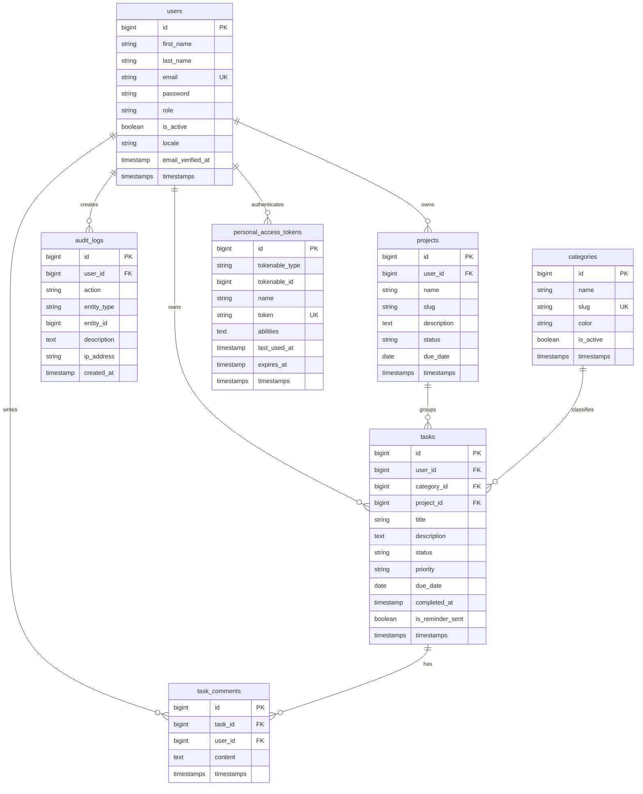

# ERD

```mermaid
erDiagram
    users ||--o{ projects : owns
    users ||--o{ tasks : owns
    users ||--o{ task_comments : writes
    users ||--o{ audit_logs : creates
    projects ||--o{ tasks : groups
    categories ||--o{ tasks : classifies
    tasks ||--o{ task_comments : has
    users ||--o{ personal_access_tokens : authenticates

    users {
        bigint id PK
        string first_name
        string last_name
        string email UK
        string password
        string role
        boolean is_active
        string locale
        timestamp email_verified_at
        timestamps timestamps
    }

    projects {
        bigint id PK
        bigint user_id FK
        string name
        string slug
        text description
        string status
        date due_date
        timestamps timestamps
    }

    categories {
        bigint id PK
        string name
        string slug UK
        string color
        boolean is_active
        timestamps timestamps
    }

    tasks {
        bigint id PK
        bigint user_id FK
        bigint category_id FK
        bigint project_id FK
        string title
        text description
        string status
        string priority
        date due_date
        timestamp completed_at
        boolean is_reminder_sent
        timestamps timestamps
    }

    task_comments {
        bigint id PK
        bigint task_id FK
        bigint user_id FK
        text content
        timestamps timestamps
    }

    audit_logs {
        bigint id PK
        bigint user_id FK
        string action
        string entity_type
        bigint entity_id
        text description
        string ip_address
        timestamp created_at
    }

    personal_access_tokens {
        bigint id PK
        string tokenable_type
        bigint tokenable_id
        string name
        string token UK
        text abilities
        timestamp last_used_at
        timestamp expires_at
        timestamps timestamps
    }
```
